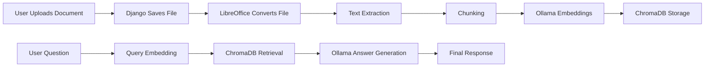

# AI Document Chat System

A local-first AI-powered document assistant built with Django, ChromaDB, and Ollama.  
Upload documents, extract and index their content into a vector database, and chat with them using retrieval-augmented generation (RAG).

---

## Overview

This project demonstrates a full RAG pipeline in a practical Django application:

- Document upload and storage.
- Text extraction from uploaded files.
- Chunking and embedding generation.
- Vector storage in ChromaDB.
- Semantic retrieval using query embeddings.
- Response generation using a local Ollama model.

The system is designed to run locally without external API costs, making it ideal for privacy-sensitive workflows and offline development. Ollama supports embedding models for RAG applications, and ChromaDB provides collection-based vector search. [web:4][web:30][web:27]

---

## Features

- Upload documents from the browser.
- Preview supported files in the UI.
- Convert office documents using LibreOffice headless mode.
- Extract and clean text from documents.
- Split document content into semantic chunks.
- Generate embeddings locally with Ollama.
- Store embeddings in ChromaDB.
- Ask natural-language questions about uploaded documents.
- Retrieve relevant context and generate grounded answers.
- Fully local, free, and developer-friendly.

LibreOffice command-line conversion supports common office-document workflows, and ChromaDB manages collections of embeddings for query-time retrieval. [web:17][web:27]

---

## Tech Stack

- **Backend:** Django, Django REST Framework
- **AI / LLM:** Ollama
- **Vector Database:** ChromaDB
- **Document Processing:** LibreOffice, BeautifulSoup
- **Frontend:** Bootstrap 5, HTML, CSS, JavaScript
- **Runtime:** Python 3.12+ recommended

Ollama provides both Python libraries and REST APIs for model integration, which makes it easy to connect local embeddings and chat models to a Django app. [web:37][web:4]

---

## Architecture



---

## Project Structure

```bash
ai_doc_chat/
├── manage.py
├── README.md
├── requirements.txt
├── media/
├── static/
├── ai_doc_chat/
│   ├── settings.py
│   ├── urls.py
│   └── wsgi.py
└── docs/
    ├── models.py
    ├── views.py
    ├── urls.py
    ├── utils.py
    ├── embeddings.py
    ├── vector_store.py
    └── templates/
        └── docs/
            ├── base.html
            ├── dashboard.html
            ├── upload.html
            └── document_detail.html
```

---

## How It Works

1. User uploads a document.
2. Django stores the file in `media/`.
3. LibreOffice converts supported office files to HTML.
4. The app extracts clean text from the converted output.
5. Text is split into chunks.
6. Each chunk is embedded using Ollama.
7. Embeddings are stored in ChromaDB.
8. On chat, the user query is embedded too.
9. ChromaDB returns the most relevant chunks.
10. Ollama generates the final answer using retrieved context.

This is a standard RAG flow: retrieve first, then generate. Ollama’s embedding workflow is explicitly designed for applications like this. [web:4][web:71]

---

## Requirements

### System
- macOS or Linux
- Python 3.12+
- Homebrew (for macOS)
- LibreOffice
- Ollama

### Python packages
- Django
- djangorestframework
- chromadb
- ollama
- beautifulsoup4
- python-docx
- odfpy

---

## Installation

### 1. Clone repository
```bash
git clone <your-repo-url>
cd ai_doc_chat
```

### 2. Create virtual environment
```bash
python3 -m venv .venv
source .venv/bin/activate
```

### 3. Install dependencies
```bash
pip install -r requirements.txt
```

### 4. Install system tools
```bash
brew install --cask libreoffice
brew install ollama
```

### 5. Pull Ollama models
```bash
ollama pull llama3.1
ollama pull nomic-embed-text
```

Ollama supports embedding models directly, and Chroma provides integration patterns for Ollama embeddings. [web:4][web:1]

---

## Configuration

### `settings.py`
```python
INSTALLED_APPS = [
    'rest_framework',
    'docs',
]

MEDIA_URL = '/media/'
MEDIA_ROOT = BASE_DIR / 'media'
STATIC_URL = '/static/'
STATICFILES_DIRS = [BASE_DIR / 'static']
```

### Optional environment variables
```env
DEBUG=True
SECRET_KEY=replace-me
```

---

## API Endpoints

### Upload document
`POST /api/upload/`

Form-data:
- `title`
- `file`

### Chat with document
`POST /api/chat/<doc_id>/`

JSON:
```json
{
  "message": "What is this document about?"
}
```

### View document page
`GET /doc/<doc_id>/`

Django REST Framework is a natural fit for multipart uploads and JSON chat endpoints. [web:29][web:32][web:38]

---

## Example Usage

### Upload
```bash
curl -X POST http://127.0.0.1:8000/api/upload/ \
  -F "title=Test Document" \
  -F "file=@/path/to/sample.docx"
```

### Chat
```bash
curl -X POST http://127.0.0.1:8000/api/chat/1/ \
  -H "Content-Type: application/json" \
  -d '{"message":"Summarize this document"}'
```

---

## Screenshots

Add screenshots here after UI finalization:

- Dashboard
- Upload page
- Document preview
- Chat interface

---

## Troubleshooting

### 1. Empty embeddings error
If Chroma returns an error about empty embeddings, the document text extraction likely failed or no chunks were generated. Add validation before `collection.add()` and skip empty chunks.

### 2. Ollama model not responding
Make sure the Ollama service is running:
```bash
ollama serve
```

### 3. Document preview not showing
Check if LibreOffice conversion succeeded and whether `html_path` exists.

### 4. Unsupported file type
Add file-type validation before processing.

Chroma collection add/query operations expect valid non-empty embedding records, so defensive checks are important in the upload pipeline. [web:27][web:62][web:65]

---

## Future Enhancements

- Support for PDF ingestion.
- Background jobs with Celery.
- Streaming chat responses.
- Authentication and per-user document isolation.
- Cross-document search.
- Conversation history.
- Better semantic chunking.
- Export answers as notes or markdown.

---

## Why This Project Matters

This project demonstrates practical skills in:

- Django backend architecture.
- REST API design.
- Document parsing and preprocessing.
- Vector database usage.
- Local LLM integration.
- Retrieval-augmented generation.
- Privacy-first AI system design.

It is a strong portfolio project because it combines backend engineering, AI integration, and production-style UI into one complete product. RAG intro projects commonly emphasize the same pipeline: store knowledge, retrieve context, and generate grounded answers. [web:71][web:73][web:79]

---

## Acknowledgements

- Django
- Django REST Framework
- Ollama
- ChromaDB
- LibreOffice
