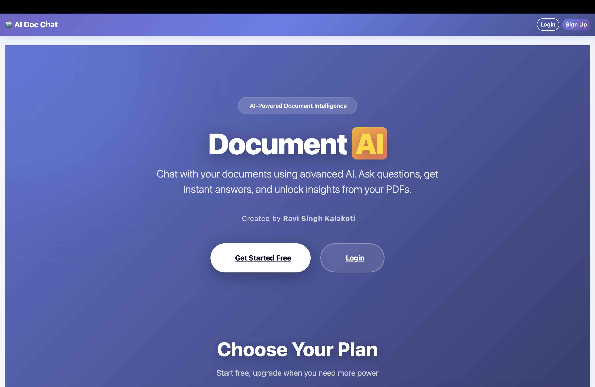
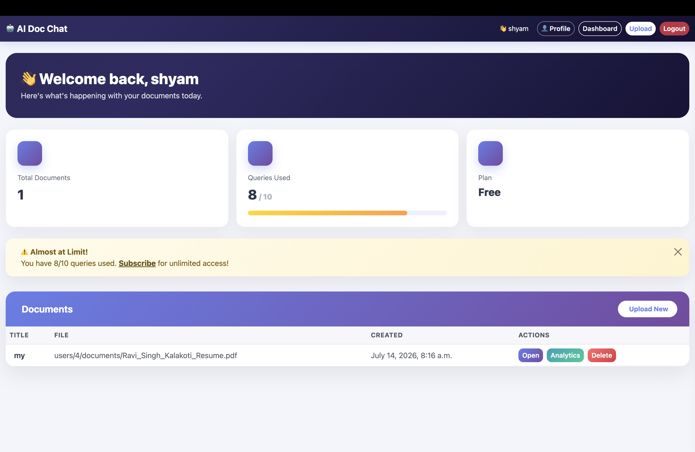
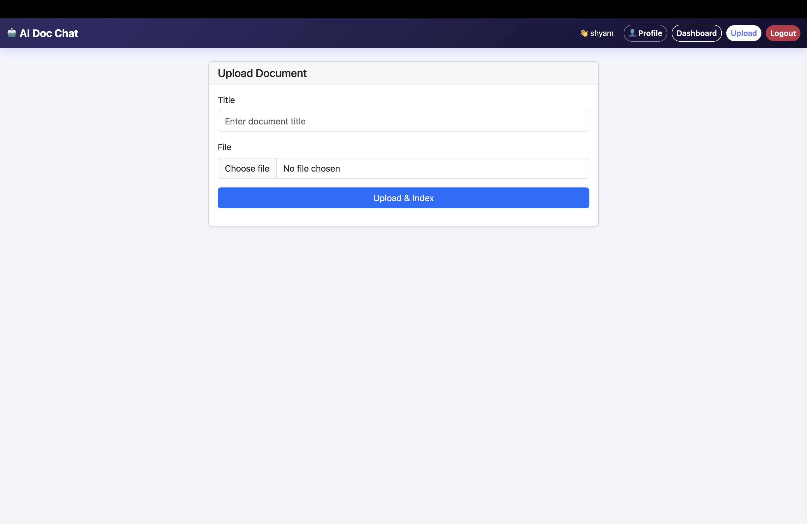
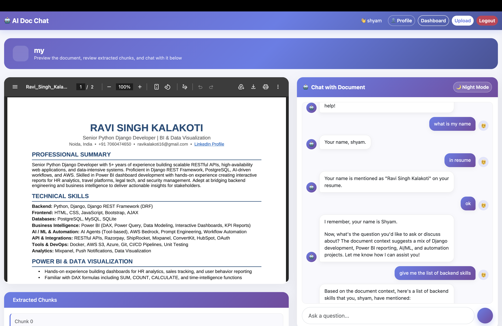
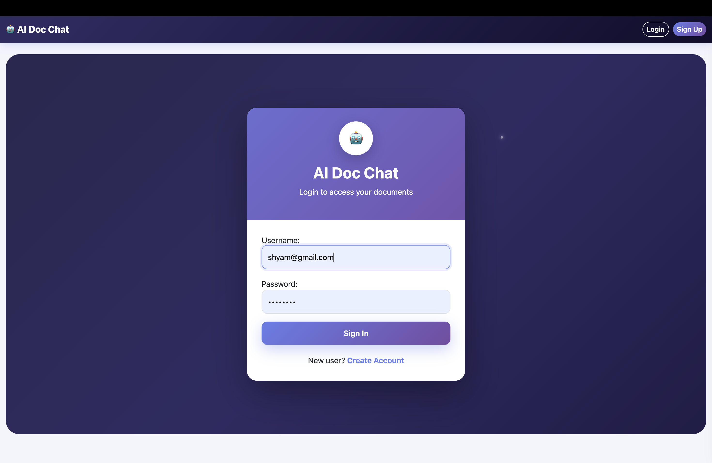
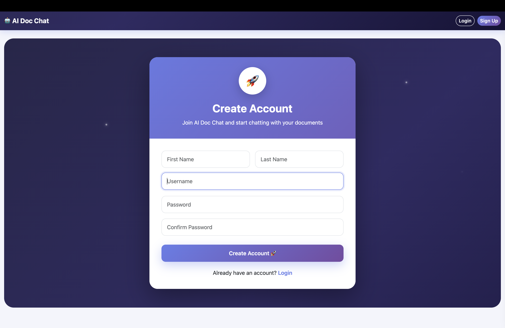
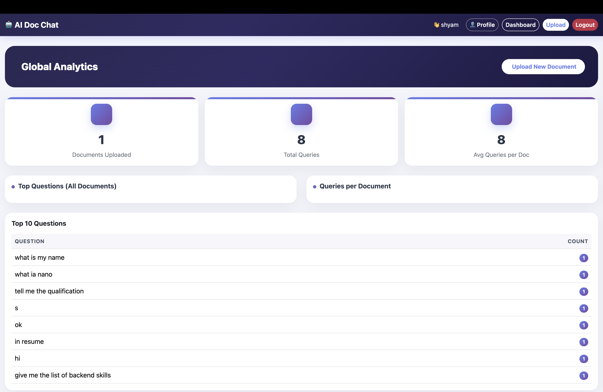

# AI Document Chat with RAG

A Django application that allows users to upload documents and chat with them using Retrieval-Augmented Generation (RAG).

The system extracts document text, generates embeddings with Ollama, stores them in ChromaDB, and retrieves relevant context to answer user questions using a local LLM.

---

## What It Does

- Upload office documents and text files.
- Extract and clean document text.
- Split text into chunks for semantic indexing.
- Generate embeddings locally using Ollama.
- Store embeddings in ChromaDB.
- Retrieve relevant chunks using vector similarity search.
- Generate grounded answers with a local LLM.

Ollama supports embeddings for RAG workflows, and ChromaDB is designed to manage collections of embeddings for query-time retrieval.

---

## Core Features

- **Document ingestion** for uploaded files.
- **Text preprocessing** and chunking.
- **Local embeddings** without external API keys.
- **Vector search** using ChromaDB.
- **RAG-based question answering**.
- **Private, offline-capable AI workflow**.
- **Django REST API** for upload and chat.

---

## Tech Stack

- Django
- Django REST Framework
- Ollama
- ChromaDB
- LibreOffice
- BeautifulSoup

---

## RAG Flow

1. User uploads a document.
2. Django saves the file.
3. LibreOffice converts supported files to HTML.
4. Text is extracted and cleaned.
5. Text is split into chunks.
6. Each chunk is embedded using Ollama.
7. ChromaDB stores the vectors.
8. User asks a question.
9. The query is embedded and matched against stored vectors.
10. Relevant chunks are sent to the LLM for final answer generation.

This is the standard retrieve-then-generate pattern used in RAG systems.

---

## Why This Project Matters

This project demonstrates practical AI engineering skills in:

- Building a full RAG pipeline.
- Working with local LLMs and embeddings.
- Designing a vector database workflow.
- Integrating document processing with AI.
- Creating a privacy-first AI application.

---

## APIs

### Upload
`POST /api/upload/`

### Chat
`POST /api/chat/<doc_id>/`

### Document View
`GET /doc/<doc_id>/`

---

## Setup

```bash
git clone <repo-url>
cd ai_doc_chat
python3 -m venv .venv
source .venv/bin/activate
pip install -r requirements.txt
brew install --cask libreoffice
brew install ollama
ollama pull llama3.1
ollama pull nomic-embed-text
python manage.py migrate
python manage.py runserver
```

---
## 🎯 Live System Preview

A fully functional AI-powered document chat system using RAG architecture.

### 🏡 Home


### 📊 Dashboard


### 📤 Upload Document


### 📄 Document Preview


### 🤖 AI Document Chat


### 🔐 Login


### 📝 Sign Up


### 📈 Global Analytics


---

## Future Scope

- PDF support
- Chat history
- User authentication
- Background indexing
- Cross-document search
- Response streaming

---
